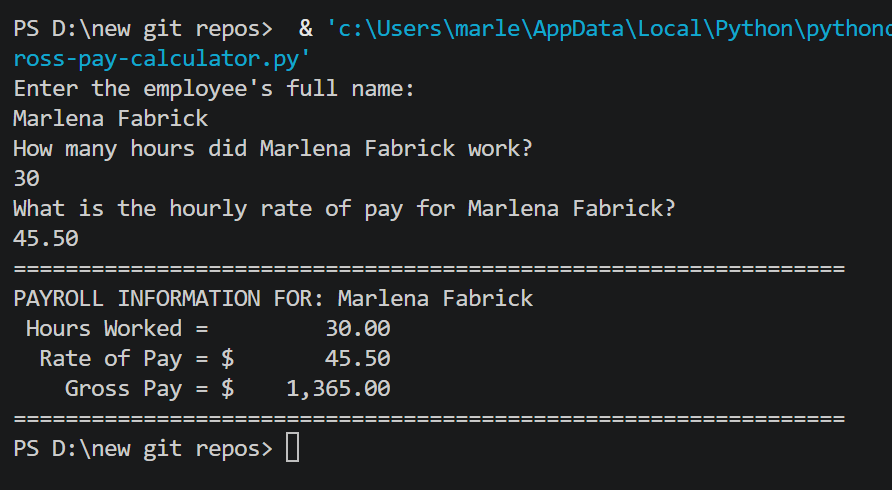

# 💼 Gross Pay Calculator

A beginner Python console application that calculates an employee's gross pay based on hours worked and hourly pay rate, then displays a clean formatted payroll report.

---

## Features

- Prompts for employee name, hours worked, and pay rate
- Calculates gross pay using the formula: `hours × rate`
- Displays a right-aligned, formatted payroll summary
- Input validation — catches non-numeric entries and prompts again

---

## How It Works

1. User enters the employee's full name
2. User enters hours worked (decimal values accepted, e.g. `40.5`)
3. User enters hourly pay rate (e.g. `15.00`)
4. Program multiplies hours × rate to get gross pay
5. Results are printed in a formatted table with dollar signs and commas

---

## Example Output

```
Enter the employee's full name:
Jane Smith
How many hours did Jane Smith work?
40
What is the hourly rate of pay for Jane Smith?
17.50
================================================================
PAYROLL INFORMATION FOR: Jane Smith
 Hours Worked =         40.00
  Rate of Pay = $       17.50
    Gross Pay = $      700.00
================================================================
```

---

## Screenshot



---

## Technologies Used

- Python 3
- Built-in `format()` function for column-aligned numeric output
- `try/except` for input validation

---

## Learning Outcomes

- Variables and data types (`float`, `str`)
- Arithmetic operations
- String formatting with `format()` and f-strings
- Input validation using `try/except` and `while` loops
- Console output formatting

---

## How to Run

1. Make sure Python 3 is installed: https://www.python.org/downloads/
2. Clone or download this repo
3. Open a terminal in the repo folder
4. Run: `python gross_pay_calculator.py`
5. Follow the prompts

---

## Folder Structure

```
gross-pay-calculator/
├── gross_pay_calculator.py
├── output.png
├── README.md
├── LICENSE
└── .gitignore
```

---

## License

This project is licensed under the MIT License — see the [LICENSE](LICENSE) file for details.

---

*Written by Marlena Fabrick — Computer Programming, Fall 2020*


---


